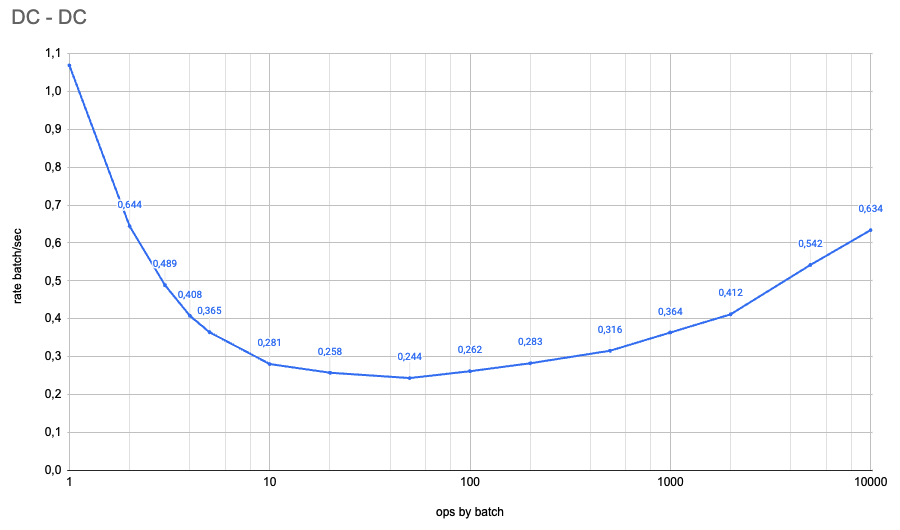
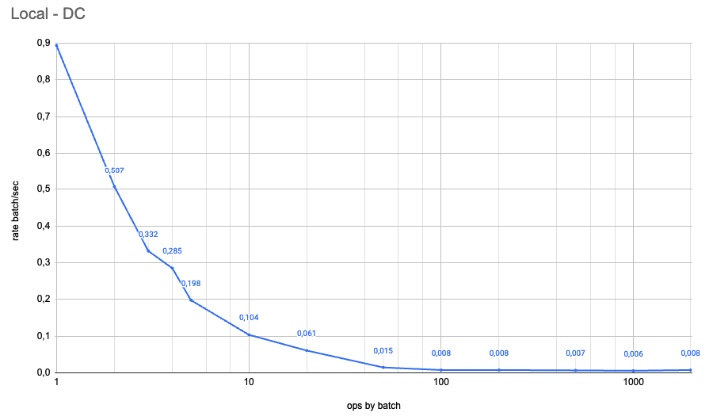
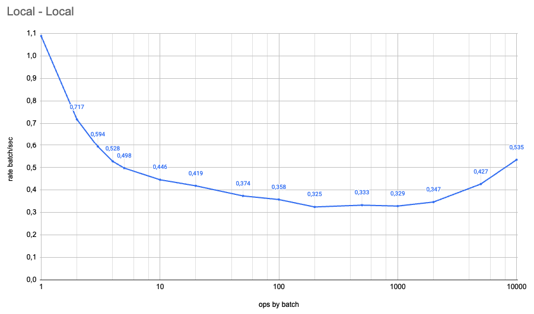

# dbbatch

Библиотека предоставляет возможность группировать запросы в БД батчами без необходимости переходить на низкоуровневые
абстракции драйвера, например pgx.

Позволяет:

- уменьшить количество сетевых обменов с базой
- оптимизировать время выполнения взаимодействия с базой
- уменьшить время нахождения в транзакции
- быстрее выполнять работу и освободить соединение с базой для других задач

Представляет собой обертку над sqlx, sql и драйвером pgx.

Ниже также можно увидеть результаты бенчмарков.

## Использование

### Установка

Нужен go >= v1.20

```bash
go get github.com/jackc/pgx/v5@latest
# or
go get github.com/jackc/pgx/v4@latest
go get github.com/inna-maikut/dbbatch@latest
```

### Добавление обертки в storage

```diff
  import (
      ...
+     "github.com/inna-maikut/dbbatch"
+     _ "github.com/inna-maikut/dbbatch/pgx_v4"
  )

  func NewStorage() {
      db, err := psql.Connect(
          ...,
+         psql.WithDriverName("batch_pgx"),
+         psql.WithOriginalDriverName("pgx"),
      )
    
    
-     return storage.New(db)
+     return storage.New(dbbatch.New(db))
}
```

Нужно подключить "github.com/inna-maikut/dbbatch/pgx_v4" или "github.com/inna-maikut/dbbatch/pgx_v5",
чтобы драйвер `batch_pgx` зарегистрировался

### Работа с батчем

`dbbatch.Batch` - это структура со списком запускаемых коллбеков, которые можно добавить методом `Add`.

Коллбеки синхронизированы и защищаться от race-а не нужно.

```go
b := &dbbatch.Batch{}

b.Add(func (ctx context.Context) error {
    _, err := db.ExecContext(ctx, "update items set name = $1 where id = $2", name, itemID)
    if err != nil {
        return fmt.Errorf("set item name: %w", err)
    }
    return nil
})


var items []entity.Item
b.Add(func (ctx context.Context) {
    err := db.SelectContext(ctx, &items, "select name, user_id from items where id = $1", itemID)
    if err != nil {
        return fmt.Errorf("set item name: %w", err)
    }
    return nil
})
// ...

// SendBatch - отправить батч через db, conn, или tx

// do something with result, e.g. items
```

### 1 вариант, отправка батча через db

Обязательно использовать методы db, которые принимают контекст. Если не прокинуть контекст, то запрос отправится
мимо батча, так лучше не делать.

Методы открытия транзакции, stmt при вызове внутри батча
вернут ошибку, как использовать транзакцию смотри в 3 варианте.

```go
// db = dbbatch.New(sqlxDB)

b := &dbbatch.Batch{}

b.Add(func (ctx context.Context) error {
    _, err := db.ExecContext(ctx, "update items set name = $1 where id = $2", name, itemID)
    if err != nil {
        return fmt.Errorf("set item name: %w", err)
    }
    return nil
})

var items []entity.Item
b.Add(func (ctx context.Context) {
    err := db.SelectContext(ctx, &items, "select name, user_id from items where id = $1", itemID)
    if err != nil {
        return fmt.Errorf("set item name: %w", err)
    }
    return nil
})

err := db.SendBatch(b)
if err != nil {
    // handle errors
}
```

### 2 вариант, отправка батча через conn

Контекст можно не прокидывать, также можно вне коллбека батча использовать соединение почти как в обычном режиме.

Методы открытия транзакции, stmt при вызове внутри батча
вернут ошибку, как использовать транзакцию смотри в 3 варианте.

Обязательно нужно закрыть conn по окончанию работы с ним, как и для обычного `sql.Conn/sqlx.Conn`, чтобы вернуть его в
пул.

```go
// db = dbbatch.New(sqlxDB)

conn, err := db.BatchConn(ctx)
if err != nil {
    // handle error
}
defer conn.Close()

b := &dbbatch.Batch{}

row, err := conn.QueryContext(...)
// так делать можно, но данный запрос отправляется без батча
if err != nil {
    // handle error
}

b.Add(func (ctx context.Context) error {
    // контекст прокидывать необязательно
    _, err := conn.Exec("update items set name = $1 where id = $2", name, itemID)
    if err != nil {
        return fmt.Errorf("set item name: %w", err)
    }
    return nil
})

var items []entity.Item
b.Add(func (ctx context.Context) {
    err := conn.SelectContext(ctx, &items, "select name, user_id from items where id = $1", itemID)
    if err != nil {
    return fmt.Errorf("set item name: %w", err)
    }
    return nil
})

err = conn.SendBatch(b)
if err != nil {
    // handle errors
}
```

### 3 вариант, отправка батча внутри транзакции

Контекст можно не прокидывать, также можно вне коллбека батча использовать транзакцию почти как в обычном режиме.

Методы stmt при вызове внутри батча вернут ошибку.

Обязательно нужно сделать commit или rollback, как и для обычной `sql.Tx/sqlx.Tx`,
чтобы не зависнуть навсегда или до отмены контекста

```go
// db = dbbatch.New(sqlxDB)

tx, err := db.BeginBatchTx(ctx, &sql.Options{})
if err != nil {
    // handle error
}

b := &dbbatch.Batch{}

row, err := tx.QueryContext(...)
// так делать можно, но данный запрос отправляется без батча
if err != nil {
    // handle error
}

b.Add(func (ctx context.Context) error {
    // контекст прокидывать необязательно
    _, err := tx.Exec("update items set name = $1 where id = $2", name, itemID)
    if err != nil {
        return fmt.Errorf("set item name: %w", err)
    }
    return nil
})

var items []entity.Item
b.Add(func (ctx context.Context) {
    err := tx.SelectContext(ctx, &items, "select name, user_id from items where id = $1", itemID)
    if err != nil {
        return fmt.Errorf("set item name: %w", err)
    }
    return nil
})

err = tx.SendBatch(b)
if err != nil {
    // handle errors
}

err = tx.Commit()
// or tx.Rollback()
if err != nil {
    // handle errors
}
```

### Fallback

При отсутствии подключенного драйвера `batch_pgx` в качестве базового для `sql`,
используется последовательная версия без батча.

Также есть метод батча `RunSequential`

```go
b := &dbbatch.Batch{}
// ...
err := b.RunSequential(ctx)
// ...
```

### Опция WithoutCancel

```go
db := dbbatch.New(sqlxDB, dbbatch.WithoutCancel(true))
```

При наличии этой опции драйвер и использовании *BatchDB/*BatchConn прокидывается защищенный от отмены контекст.

Не работает с

- Stmt - PrepareContext, PreparexContext и методами самого sql.Stmt/sqlx.Stmt
- Транзакцией - BeginTx, BeginTxx и методы самого sql.Tx/sqlx.Tx

Если это возможно, то сначала забирается соединение из пула с оригинальным контекстом
(возможно с отменой, тогда ожидание освобождения соединение прервется, это безопасно),
далее дергается метод соединения без отмены контекста.

## Бенчмарки

Для тестирования используются легкие запросы на update записи в различных кейсах:

* seq - последовательное выполнение запросов по одному
* seq single conn - последовательное выполнение запросов по одному на выделенном соединении с базой
* batch - отправка батчами размером с `ops by batch`
* batch seq - отправка последовательно через функционал батча последовательно исполнения запросов/коллбека
* upsert - отправка запросами `insert ... on conflict update set ...` по `ops by batch` айтемов

Единица измерения данных по каждому кейсу seq, seq single conn, batch, batch seq, upsert - время одной операции, `total case execution time / case ops`

Обозначения

* `ops` - количество операций (без привязки ко времени)
* `ops by batch` - количество операций в одном батче
* `ops = ops by batch * batches count` - количество запросов в базу для данного `ops by batch`.
Количество запросов одинаковое во всех кейсах и примерно совпадает между `ops by batch` с учетом кратности.
* `rate batch/seq = batch / seq` показывает соотношение среднего времени, затраченную на одну операцию,
при отправке батчем и последовательными запросами по одному.

### Графики `rate batch/seq` от `ops by batch`

|              DC-DC               |                 Local-DC                  |                    Local-Local                     |
|:--------------------------------:|:-----------------------------------------:|:--------------------------------------------------:|
|  |  |  |

Вывод: если нужно отправить много запросов, имеет смысл группировать их в батчи по 50.

### DC-DC

С инстанса в ДЦ в postgresql в ДЦ (сценарий для сервисов в prod/staging среде)

| ops by batch | ops   |        seq | seq single conn |      batch |  batch seq |    upsert | rate batch/seq |
|-------------:|-------|-----------:|----------------:|-----------:|-----------:|----------:|----------------|
|            1 | 80000 |  724.978µs |       716.893µs |  774.245µs |  735.627µs | 742.478µs | 1.068          |
|            2 | 80000 |  700.439µs |       694.976µs |  451.128µs |  715.834µs | 377.001µs | 0.644          |
|            3 | 80160 |  689.669µs |       689.295µs |  337.349µs |  702.506µs |  252.64µs | 0.489          |
|            4 | 80000 |  684.911µs |       687.626µs |  279.522µs |  704.782µs | 192.531µs | 0.408          |
|            5 | 80000 |  685.756µs |       690.838µs |  250.334µs |  698.019µs | 156.694µs | 0.365          |
|           10 | 80000 |  705.814µs |       712.149µs |  198.002µs |   712.16µs |  85.505µs | 0.281          |
|           20 | 80000 |   744.59µs |       747.089µs |  191.961µs |  747.174µs |  49.583µs | 0.258          |
|           50 | 80000 |  745.824µs |       744.717µs |  181.941µs |  749.601µs |  28.115µs | 0.244          |
|          100 | 80000 |  805.385µs |        808.01µs |  211.072µs |  812.677µs |  20.828µs | 0.262          |
|          200 | 80000 |  807.316µs |       809.001µs |  228.383µs |  820.524µs |    17.4µs | 0.283          |
|          500 | 80000 |  825.199µs |       827.658µs |  261.069µs |  848.582µs |   17.36µs | 0.316          |
|         1000 | 80000 |  875.365µs |       898.375µs |  318.347µs |  892.036µs |  17.458µs | 0.364          |
|         2000 | 80000 |  968.531µs |       972.915µs |  399.332µs |  978.719µs |  17.657µs | 0.412          |
|         5000 | 80000 |  1.22636ms |      1.241159ms |  665.262µs | 1.269729ms |  16.171µs | 0.542          |
|        10000 | 80000 | 1.781908ms |      1.720855ms | 1.129248ms | 1.746669ms |  15.813µs | 0.634          |

### Local-DC

С локального инстанса в postgresql в ДЦ

| ops by batch | ops  | seq         | seq single conn | batch       | batch seq   | upsert      | rate batch/seq |
|--------------|------|-------------|-----------------|-------------|-------------|-------------|----------------|
| 1            | 2000 | 28.638495ms | 26.055006ms     | 25.562302ms | 26.432769ms | 28.716593ms | 0.893          |
| 2            | 2000 | 26.404519ms | 25.029036ms     | 13.384127ms | 24.202764ms | 12.103045ms | 0.507          |
| 3            | 2010 | 25.076284ms | 24.982266ms     | 8.319264ms  | 25.124644ms | 8.989056ms  | 0.332          |
| 4            | 2000 | 25.314288ms | 25.915302ms     | 7.210725ms  | 24.557797ms | 6.02934ms   | 0.285          |
| 5            | 2000 | 24.621067ms | 25.930966ms     | 4.882744ms  | 25.493114ms | 5.313921ms  | 0.198          |
| 10           | 2000 | 25.221254ms | 25.379026ms     | 2.620266ms  | 25.302257ms | 2.704622ms  | 0.104          |
| 20           | 2000 | 25.795904ms | 25.990886ms     | 1.582875ms  | 25.884293ms | 959.142µs   | 0.061          |
| 50           | 2000 | 26.659322ms | 26.54228ms      | 390.503µs   | 27.349479ms | 298.13µs    | 0.015          |
| 100          | 2000 | 26.236412ms | 26.268192ms     | 215.836µs   | 26.578326ms | 120.779µs   | 0.008          |
| 200          | 2000 | 27.015359ms | 26.964349ms     | 223.421µs   | 26.031397ms | 138.882µs   | 0.008          |
| 500          | 2000 | 25.895414ms | 25.704871ms     | 183.154µs   | 26.355395ms | 48.97µs     | 0.007          |
| 1000         | 2000 | 27.754056ms | 26.692804ms     | 160.07µs    | 25.36132ms  | 90.844µs    | 0.006          |
| 2000         | 2000 | 25.484556ms | 26.767241ms     | 202.059µs   | 26.700805ms | 16.678µs    | 0.008          |

### Local-Local

С локального инстанса в локально поднятый postgresql

| ops by batch | ops    | seq        | seq single conn | batch     | batch seq  | upsert    | rate batch/seq |
|--------------|--------|------------|-----------------|-----------|------------|-----------|----------------|
| 1            | 100000 | 372.677µs  | 381.931µs       | 405.543µs | 375.846µs  | 379.423µs | 1.088          |
| 2            | 100000 | 384.821µs  | 392.731µs       | 276.07µs  | 387.95µs   | 206.998µs | 0.717          |
| 3            | 100200 | 398.152µs  | 409.761µs       | 236.306µs | 401.839µs  | 144.961µs | 0.594          |
| 4            | 100000 | 415.839µs  | 422.286µs       | 219.717µs | 417.192µs  | 113.623µs | 0.528          |
| 5            | 100000 | 423.94µs   | 432.452µs       | 211.026µs | 429.254µs  | 94.596µs  | 0.498          |
| 10           | 100000 | 461.469µs  | 471.684µs       | 205.893µs | 464.237µs  | 54.584µs  | 0.446          |
| 20           | 100000 | 507.214µs  | 517.301µs       | 212.662µs | 514.259µs  | 33.293µs  | 0.419          |
| 50           | 100000 | 519.214µs  | 520.434µs       | 193.954µs | 527.032µs  | 19.048µs  | 0.374          |
| 100          | 100000 | 551.158µs  | 555.478µs       | 197.148µs | 558.257µs  | 14.607µs  | 0.358          |
| 200          | 100000 | 554.109µs  | 551.929µs       | 180.138µs | 554.226µs  | 12.364µs  | 0.325          |
| 500          | 100000 | 584.341µs  | 585.842µs       | 194.6µs   | 588.574µs  | 12.036µs  | 0.333          |
| 1000         | 100000 | 614.515µs  | 614.858µs       | 202.143µs | 621.48µs   | 10.327µs  | 0.329          |
| 2000         | 100000 | 666.276µs  | 664.157µs       | 231.512µs | 672.125µs  | 9.211µs   | 0.347          |
| 5000         | 100000 | 810.455µs  | 816.209µs       | 345.838µs | 827.067µs  | 8.684µs   | 0.427          |
| 10000        | 100000 | 1.100971ms | 1.094383ms      | 589.461µs | 1.110084ms | 7.474µs   | 0.535          |

## Internal

Под капотом запрос прогоняется через sqlx/sql дважды.

* дергаем sqlx/sql
* в первый раз записываем готовые query и args, возвращаем пустой результат
* блокируем горутину
* когда все коллбеки в батче запущены и дошли до блокировки или завершились, отправляем батч
* разблокируем горутину
* второй раз дергаем sqlx/sql
* в этот раз подставляем результат, полученный в батче
* sqlx/sql формируют возвращаемые значение для вызванных функций
* возвращаем результат, полученный от sqlx/sql внутри коллбека

Если какие-то коллбеки не завершились, процесс повторяется -
они снова доходят до блокировки, отправляется батч и после разблокировки возвращается результат, и т.д.

## TODO

* подумать на счет begin + batch requests + commit в одном батче (сейчас begin и commit отправляется отдельно)
* больше драйверов - проверить CockroachDB
* больше тестов
* поддержка pgx v3?
